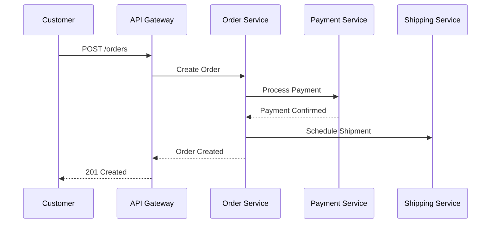

# arc42 Template Reference

arc42 provides a template for documenting software architecture. It emphasizes pragmatic, useful documentation.

**Source:** [arc42.org](https://arc42.org/) by Dr. Peter Hruschka and Dr. Gernot Starke

## Core Principles

1. **Painless Documentation** - Only describe what stakeholders need to know
2. **Pragmatic** - Focus on necessary information, not bureaucratic overhead
3. **Iterative** - Document as you go, not upfront
4. **Process-Agnostic** - Works with agile, lean, or formal processes

## The 12 Sections

### 1. Introduction and Goals

Describe the system's purpose and quality requirements.

**Include:**
- Business context and goals
- Quality requirements (scenarios or ranked list)
- Stakeholders and their concerns

**Template:**
```markdown
## 1.1 Requirements Overview
[What does the system do? Business context.]

## 1.2 Quality Goals
| Quality Attribute | Priority | Scenario |
|-------------------|----------|----------|
| Performance | High | 95% of requests < 200ms |
| Scalability | High | Handle 10x current load |
| Security | High | OWASP Top 10 compliance |

## 1.3 Stakeholders
| Role | Interest |
|------|----------|
| Product Owner | Feature delivery speed |
| Operations | System reliability |
| Security | Data protection |
```

### 2. Architecture Constraints

Document constraints that influence architecture decisions.

**Types of Constraints:**
- Organizational (team structure, processes)
- Technical (technologies, platforms)
- Regulatory (compliance, standards)
- Business (budget, timeline)

**Template:**
```markdown
## 2.1 Technical Constraints
- Must use existing CI/CD pipeline
- Database: PostgreSQL (existing license)
- Deployment: AWS (organizational standard)

## 2.2 Organizational Constraints
- Team of 5 developers
- 3-month timeline
- No external consultants

## 2.3 Regulatory Constraints
- GDPR compliance required
- SOC 2 certification needed
```

### 3. System Scope and Context

Define what's inside and outside the system.

**Include:**
- System context diagram (C4 Level 1)
- External dependencies
- Communication interfaces

**Use C4 Context diagram format** from `references/c4-model.md`.

### 4. Solution Strategy

High-level architecture decisions and patterns.

**Document:**
- Key patterns used (microservices, event-driven, etc.)
- Technology choices and rationale
- Architecture style (layered, hexagonal, etc.)

**Template:**
```markdown
## 4.1 Architecture Style
Microservices architecture with API Gateway pattern.

## 4.2 Key Patterns
- CQRS for read/write separation
- Event Sourcing for order state
- Circuit Breaker for external calls

## 4.3 Technology Decisions
| Decision | Choice | Rationale |
|----------|--------|-----------|
| API Style | REST | Team expertise, tooling |
| Messaging | Kafka | High throughput, durability |
| Cache | Redis | Performance, simplicity |
```

### 5. Building Block View

Static decomposition of the system.

**Include:**
- Container diagram (C4 Level 2)
- Component diagrams (C4 Level 3) for important containers
- Responsibilities of each building block

**Use C4 Container/Component diagram formats** from `references/c4-model.md`.

### 6. Runtime View

How building blocks work together at runtime.

**Include:**
- Key use case scenarios
- Sequence diagrams for main flows
- Error handling flows

**Template:**
```markdown
## 6.1 Order Processing Flow

```

### 7. Deployment View

How the system is deployed to infrastructure.

**Include:**
- Infrastructure topology
- Deployment environments
- Network and security boundaries

**Use deployment diagram format** from `assets/mermaid-templates/deployment.mmd`.

### 8. Cross-cutting Concepts

Concepts that apply across multiple building blocks.

**Common Cross-cutting Concerns:**
- Security (authentication, authorization)
- Logging and monitoring
- Error handling
- Configuration management
- Caching strategy

**Template:**
```markdown
## 8.1 Security
- JWT tokens for authentication
- Role-based access control (RBAC)
- API keys for service-to-service

## 8.2 Logging
- Structured JSON logging
- Centralized collection via ELK stack
- Correlation IDs for tracing

## 8.3 Error Handling
- Circuit breaker pattern
- Retry with exponential backoff
- Dead letter queues for failed messages
```

### 9. Architecture Decisions

Record important decisions using ADR format.

**Use ADR templates** from `references/adr-template.md`.

### 10. Quality Requirements

Detailed quality requirements with measurable scenarios.

**Template:**
```markdown
## 10.1 Performance
| Metric | Target | Measurement |
|--------|--------|-------------|
| Response time (p95) | < 200ms | APM monitoring |
| Throughput | 1000 req/s | Load testing |
| Database query | < 50ms | Query analysis |

## 10.2 Scalability
- Horizontal scaling for API tier
- Database read replicas
- Auto-scaling based on CPU/memory

## 10.3 Availability
- 99.9% uptime SLA
- Multi-AZ deployment
- Automated failover
```

### 11. Risks and Technical Debt

Identify known issues and potential problems.

**Template:**
```markdown
## 11.1 Risks
| Risk | Impact | Probability | Mitigation |
|------|--------|-------------|------------|
| Vendor lock-in | High | Medium | Abstract interfaces |
| Scaling bottleneck | High | Low | Load testing |

## 11.2 Technical Debt
| Debt Item | Impact | Effort to Fix |
|-----------|--------|---------------|
| Legacy auth module | Medium | 2 sprints |
| Missing integration tests | High | 1 sprint |
```

### 12. Glossary

Define domain terms and abbreviations.

**Template:**
```markdown
| Term | Definition |
|------|------------|
| SKU | Stock Keeping Unit - unique product identifier |
| SLA | Service Level Agreement |
| CQRS | Command Query Responsibility Segregation |
```

## arc42 Canvas

The arc42 Canvas provides a one-page summary of the most important architecture information. Useful for:
- Quick overviews
- Presentations
- Architecture reviews

## Best Practices

1. **Iterate** - Start with section 1, then fill others as needed
2. **Keep it Lean** - Don't over-document; focus on value
3. **Link to Code** - Reference actual implementation where possible
4. **Review Regularly** - Update documentation with changes
5. **Use Diagrams** - Visualize complex structures
6. **Document Decisions** - ADRs in section 9 are crucial
