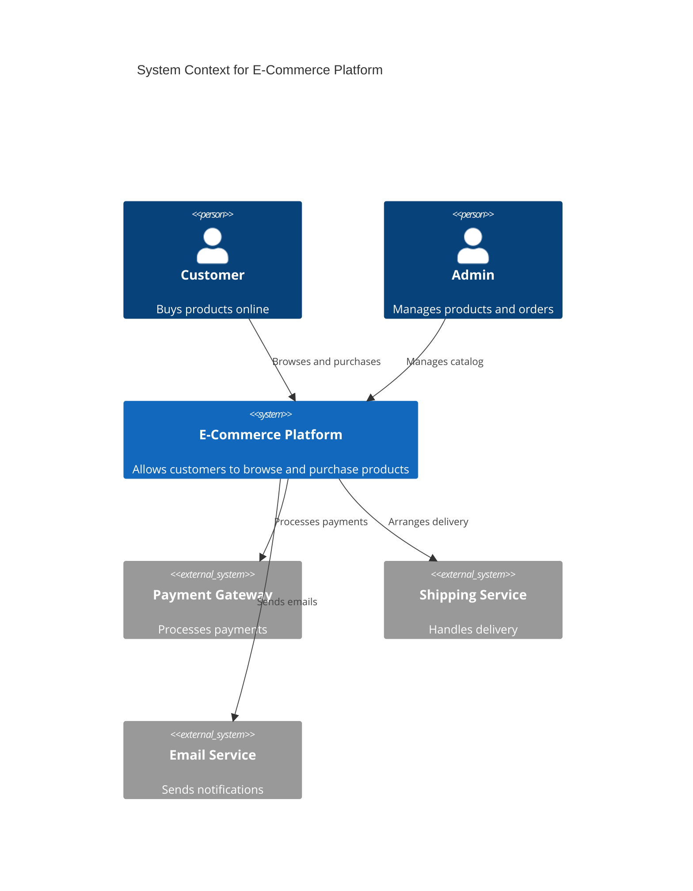
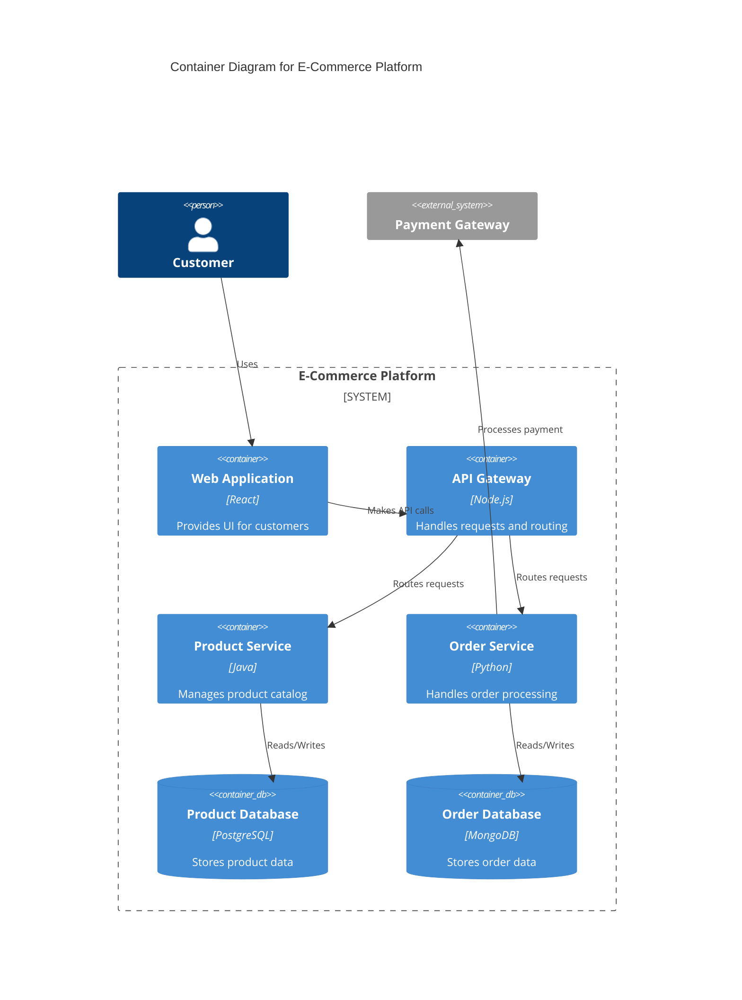

# C4 Model Reference

The C4 Model provides a hierarchical way to visualize software architecture at different levels of abstraction.

**Source:** [c4model.com](https://c4model.com/) by Simon Brown

## Four Levels

### Level 1: System Context

**Purpose:** Show the system in its environment - who uses it and what it connects to.

**Elements:**
- **Person**: Users of the system (roles, not individuals)
- **Software System**: The system being documented
- **External System**: Other systems it integrates with

**Audience:** Everybody, both technical and non-technical.

**When to Use:** Always. This is the recommended starting point for all software development teams.

**Diagram:** `assets/mermaid-templates/c4-context.mmd`

**Example:**

### Level 2: Container Diagram

**Purpose:** Zoom into the system boundary to show high-level technology building blocks.

**Elements:**
- **Container**: Applications or data stores (web app, API, database, etc.)
- **Person**: Still shown for context
- **External System**: Still shown for context

**Key Definition:** A container is a runtime boundary around code or data. NOT Docker containers specifically. Examples: server-side web app, client-side web app, mobile app, database, file system, shell script.

**Key Decisions to Document:**
- Technology choices (why React vs Angular?)
- Communication protocols (REST vs GraphQL vs gRPC)
- Data storage choices (SQL vs NoSQL)

**Diagram:** `assets/mermaid-templates/c4-container.mmd`

**Example:**

**Note on Web Applications:** If building a server-side web app generating static HTML, it's one container. If there's significant JavaScript (SPA), treat client and server as two separate containers.

### Level 3: Component Diagram

**Purpose:** Zoom into a container to show its internal components and their interactions.

**Elements:**
- **Component**: Major structural blocks within a container
- **Interface**: Public APIs exposed by components

**When to Use:**
- Complex containers with multiple responsibilities
- When onboarding new developers
- When making changes to internal structure

**Diagram:** `assets/mermaid-templates/c4-component.mmd`

### Level 4: Code Diagram

**Purpose:** Show how classes and relationships implement a component.

**Elements:**
- **Class**: Implementation classes
- **Interface**: Abstract interfaces
- **Relationship**: Inheritance, composition, dependency

**When to Use:**
- Complex algorithms or patterns
- Library/framework internals
- When code structure is non-obvious

**Note:** Usually auto-generated from IDE or tools like PlantUML.

## Supporting Diagram Types

Beyond the core 4 levels, C4 supports:

| Diagram | Purpose | When to Use |
|---------|---------|-------------|
| **System Landscape** | Show multiple systems in an organization | Enterprise view |
| **Dynamic** | Show runtime interactions between elements | Behavior focus |
| **Deployment** | Show mapping to infrastructure | Deployment decisions |

## C4 Diagram Review Checklist

Use this checklist when reviewing or creating C4 diagrams:

### General
- [ ] Diagram has a title
- [ ] Diagram type is clear (Context, Container, Component, Code)
- [ ] Diagram scope is defined
- [ ] Diagram has a key/legend

### Elements
- [ ] Every element has a name
- [ ] Element types are clear (level of abstraction)
- [ ] What each element does is understood
- [ ] Technology choices documented (where applicable)
- [ ] All acronyms and abbreviations explained
- [ ] Colors, shapes, icons meaning is clear
- [ ] Border styles meaning is clear
- [ ] Element sizes meaning is clear

### Relationships
- [ ] Every arrow has a label describing intent
- [ ] Description matches relationship direction
- [ ] Technology choices documented (protocols, etc.)
- [ ] All acronyms and abbreviations explained
- [ ] All colors, arrow heads, line styles meaning is clear

## C4 Diagram Best Practices

1. **Start with Context** - Always begin at Level 1
2. **One Level at a Time** - Don't skip levels; each adds clarity
3. **Use Consistent Notation** - Same colors/shapes across diagrams
4. **Name Elements Clearly** - Use business-meaningful names
5. **Show Data Flow** - Include direction and protocol
6. **Add Legend** - Include element types and colors
7. **Limit Elements** - Aim for 5-7 max per diagram
8. **Be Explicit** - Don't assume knowledge; explain everything

## Complementary Diagrams

C4 diagrams pair well with:

| Diagram | Purpose | When to Add |
|---------|---------|-------------|
| **Sequence** | Show interaction flows | When behavior is complex |
| **Deployment** | Show infrastructure | When deployment matters |
| **State** | Show lifecycle states | When state machines exist |
| **Package** | Show code organization | When module structure matters |

## Common Mistakes

- **Too many elements** per diagram (aim for 5-7 max)
- **Inconsistent naming** across diagrams
- **Missing data flow** direction
- **Mixing abstraction levels** in one diagram
- **Forgetting external systems** in Context diagram
- **Confusing C4 containers with Docker containers**
- **Skipping the legend/key**
- **Using implementation-specific names** at Context level
