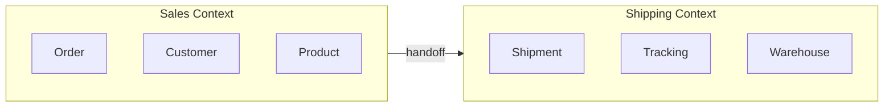
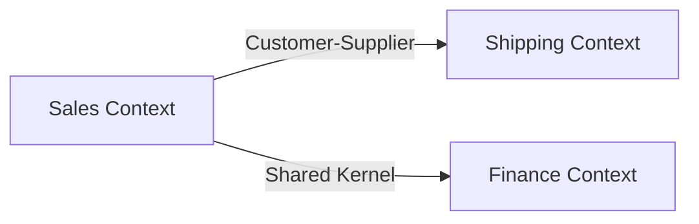

# Domain-Driven Design

Systematic approach to modeling complex business domains.

## DAP contribution

For a DAP invocation, read `framework/contribution-contract.md` from the outer
package root (the repository root in a source checkout). Keep standalone tasks
within their requested scope. Use `assets/review-template.md` and record domain-expert confirmation, context/invariant IDs, owning teams, cross-context dependencies and invariant verification.
Return evidence-linked proposals and VER plans, not invented approvals or delivery proof.

## Workflow

```
1. Explore Domain → Understand business language
2. Identify Bounded Contexts → Define boundaries
3. Map Contexts → Relationships between contexts
4. Model Aggregates → Transactional consistency boundaries
5. Define Tactical Patterns → Entities, value objects, repositories
6. Refactor → Continuous model refinement
```

## Step 1: Ubiquitous Language

Create shared language between developers and domain experts.

| Term | Definition | Example |
|------|------------|---------|
| **Entity** | Object with identity | Customer (identified by ID) |
| **Value Object** | Immutable, no identity | Address (compared by value) |
| **Aggregate** | Consistency boundary | Order (contains OrderLines) |
| **Domain Event** | Something that happened | OrderPlaced |
| **Command** | Request to do something | PlaceOrder |

## Step 2: Strategic Design

### Bounded Context

A boundary within which a particular domain model applies.



### Context Mapping Patterns

| Pattern | Description | Use When |
|---------|-------------|----------|
| **Shared Kernel** | Shared model between contexts | Tight collaboration |
| **Customer-Supplier** | Upstream/downstream dependency | Service dependency |
| **Conformist** | Downstream conforms to upstream | No control over upstream |
| **Anti-Corruption Layer** | Translation layer | Integrating legacy |
| **Open Host Service** | Public API | Multiple consumers |
| **Published Language** | Shared specification | Cross-team |

### Context Map Example



## Step 3: Tactical Design

### Aggregate Design Rules

1. **Prefer one aggregate per transaction** — Validate invariants before choosing cross-aggregate coordination
2. **Reference by identity** — Don't reference other aggregates directly
3. **Small aggregates** — Keep minimal
4. **Invariant consistency** — All rules enforced within aggregate

### Aggregate Example

```python
class Order:  # Aggregate Root
    def __init__(self, order_id, customer_id):
        self.order_id = order_id
        self.customer_id = customer_id  # Reference by ID
        self.lines = []  # OrderLine is part of aggregate
    
    def add_line(self, product_id, quantity):
        # Invariant: max 10 items per order
        if len(self.lines) >= 10:
            raise OrderLimitExceeded()
        self.lines.append(OrderLine(product_id, quantity))
```

### Entity vs Value Object

An in-memory aggregate check does not protect against concurrent writers.
Specify atomic persistence, concurrency/version checks and conflict behavior
with arch-data; test the invariant under competing commands.

| Aspect | Entity | Value Object |
|--------|--------|--------------|
| **Identity** | Has unique ID | Compared by attributes |
| **Mutability** | May change while preserving identity | Model as immutable values |
| **Equality** | Same ID = equal | All attributes equal |
| **Example** | Customer, Order | Address, Money, DateRange |

### Repository Pattern

```python
class OrderRepository:
    def find_by_id(self, order_id) -> Order:
        # Load aggregate from store
        raise NotImplementedError
    
    def save(self, order: Order):
        # Persist aggregate changes
        raise NotImplementedError
```

### Domain Services

When logic doesn't belong to any entity:

```python
class PricingService:
    def calculate_discount(self, order, customer):
        # Business rule involving multiple entities
```

## Step 4: Event Storming

### Workshop Steps

1. **Big Picture** — Everyone sticks events on wall
2. **Process Modeling** — Identify commands, policies
3. **Service Definition** — Identify bounded contexts
4. **Implementation** — Design aggregates and flows

### Event Storming Notation

| Color | Meaning |
|-------|---------|
| **Orange** | Domain Event |
| **Blue** | Command |
| **Yellow** | Aggregate |
| **Green** | Read Model |
| **Red** | Policy/Rules |
| **Purple** | External System |

## Step 5: DDD Smells

| Smell | Problem | Solution |
|-------|---------|----------|
| **Anemic Domain** | Logic in services, not entities | Move logic to entities |
| **God Aggregate** | Too much in one aggregate | Split into smaller |
| **Primitive Obsession** | Primitives instead of VOs | Create value objects |
| **Hidden Bounded Context** | No clear boundaries | Define contexts |

## Examples

- Facilitate an Event Storming session to find bounded contexts in an insurance domain.
- Split a god aggregate handling orders, inventory, and pricing into consistent boundaries.
- Map context relationships between a new platform and a legacy billing system with an ACL.

## Common Gotchas

- Bounded contexts follow business language boundaries, not database or team org charts.
- Large aggregates serialize writes and cause contention; keep them small around true invariants.
- An anemic domain model with all logic in services loses the point of DDD.

## Further Reading

- `references/awesome-architecture.md` — Curated external articles, videos, libraries, and samples per topic (awesome-architecture.com)
- `references/ddd-deep-dive.md` — Domain-Driven Design Deep Dive
- `references/strategic-design.md` — Strategic Design Reference
- `references/tactical-patterns.md` — Tactical Design Reference

## Cross-skill handoff

Obtain business vocabulary and disputed invariants from domain experts. Return context
relationships, aggregate consistency boundaries and ownership to arch-patterns, arch-data and arch-microservices. A bounded context is a modeling boundary, not a mandatory
network service; separate internal domain events from versioned integration events with
arch-event.

## Related Skills

- **arch-microservices** - Bounded contexts as service boundaries
- **arch-event** - Domain events and eventual consistency
- **arch-patterns** - Clean/Hexagonal architectures that host the domain model
