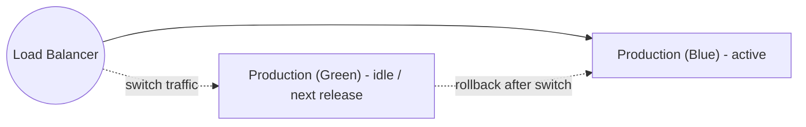
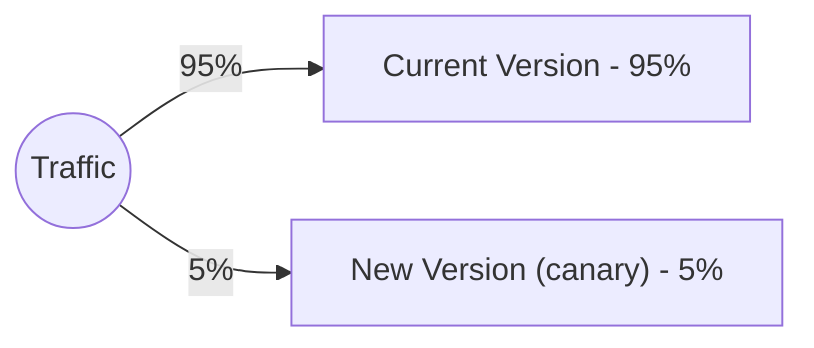
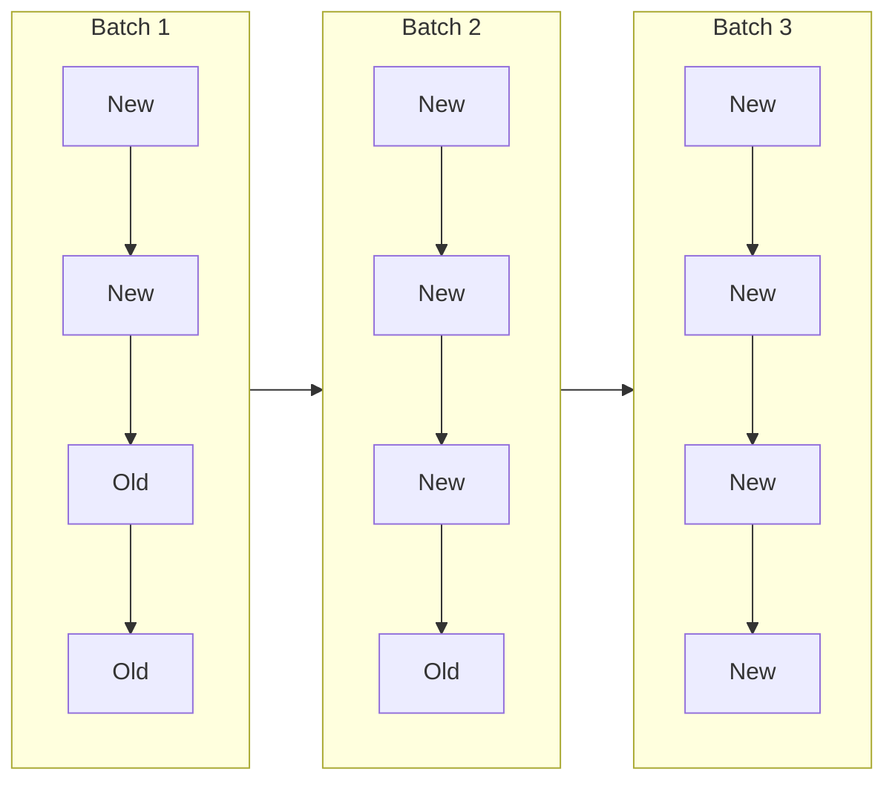
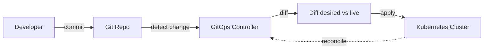

# DevOps & Deployment Architecture

Systematic approach to infrastructure automation, CI/CD, deployment strategies, and release engineering.

## DAP contribution

For a DAP invocation, read `framework/contribution-contract.md` from the outer
package root (the repository root in a source checkout). Keep standalone tasks
within their requested scope. Use `assets/review-template.md` and record artifact identity and provenance, environment ownership, promotion approvals, rollout/rollback thresholds and verification evidence.
Return evidence-linked proposals and VER plans, not invented approvals or delivery proof.

## Workflow

```
1. Define Infrastructure → IaC for provisioning
2. Build Pipeline → CI/CD stages and gates
3. Choose Deployment Strategy → Blue-green, canary, rolling
4. Plan Environments → Dev, staging, production parity
5. Manage Releases → Versioning, approvals, communication
6. Prepare Rollback → Recovery procedures
7. Measure → DORA metrics, pipeline health
```

## Step 1: Infrastructure as Code

### IaC Tools

| Tool | Type | Use Case |
|------|------|----------|
| **Terraform** | Multi-cloud | Infrastructure provisioning |
| **Pulumi** | Multi-cloud | IaC with programming languages |
| **CloudFormation** | AWS | AWS-specific provisioning |
| **ARM/Bicep** | Azure | Azure-specific provisioning |
| **Ansible** | Config mgmt | Configuration and deployment |

### IaC Best Practices

| Practice | Description |
|----------|-------------|
| **Version Control** | Store IaC in Git |
| **Modular Design** | Reusable modules |
| **State Management** | Remote state with locking |
| **Plan/Apply** | Review changes before apply |
| **Immutable Infrastructure** | Replace, don't modify |

### Configuration Patterns

| Pattern | Description |
|---------|-------------|
| **Configuration as Code** | Version-controlled configs |
| **Secrets Management** | Vault, AWS Secrets Manager |
| **Feature Flags** | Runtime feature control (see arch-features) |

## Step 2: CI/CD Pipeline

### Pipeline Stages

```
Code → Build → Test → Security → Stage → Deploy → Monitor
```

| Stage | Purpose | Tools |
|-------|---------|-------|
| **Code** | Version control | Git, GitHub, GitLab |
| **Build** | Compile, package | Maven, npm, Docker |
| **Test** | Automated tests | JUnit, pytest, Jest |
| **Security** | Vulnerability scan | Snyk, Trivy, SonarQube |
| **Stage** | Deploy to staging | Terraform, Ansible |
| **Deploy** | Deploy to production | Kubernetes, ArgoCD, ECS |
| **Monitor** | Health checks | Prometheus, Datadog |

### Pipeline Principles

- **Fast feedback**: Fail early, fail fast
- **Parallel execution**: Run independent stages in parallel
- **Artifact immutability**: Same artifact promoted across environments
- **Environment parity**: Staging ≈ Production
- **Traceable supply chain**: Build outputs carry dependency, SBOM and provenance evidence

## Step 3: Deployment Strategies

### Blue-Green Deployment



| Pros | Cons |
|------|------|
| Low-downtime traffic switch when validated | Parallel capacity cost |
| Rapid application rollback when state-compatible | Data recovery is separate |
| Full testing before switch | Stateful data cutover |

### Canary Deployment



| Pros | Cons |
|------|------|
| Gradual rollout | Complex routing |
| Risk limited to small percentage | Monitoring overhead |
| Quick rollback | Slower full deployment |

### Rolling Deployment



| Pros | Cons |
|------|------|
| Reuses the fleet; surge capacity may be needed | Rollback complicated |
| Gradual rollout | Version skew possible |
| Simple | Slower than blue-green |

### Recreate

```
[Old] → [Stop] → [Start] → [New]
```

Simple and clean-state, but causes downtime. Use only with an explicitly accepted
outage window and recovery plan, regardless of whether the system is internal.

### Strategy Selection

| Requirement | Strategy |
|-------------|----------|
| Low-downtime traffic switch with compatible state | Blue-green, after cutover/rollback rehearsal |
| Risk mitigation on user-facing change | Canary |
| Resource-constrained, tolerate skew | Rolling |
| Downtime acceptable | Recreate |

## Step 4: Container Orchestration

### Kubernetes Building Blocks

| Component | Description |
|-----------|-------------|
| **Pod** | Smallest deployable unit |
| **Deployment** | Manages pod replicas and rolling updates |
| **Service** | Network endpoint for pods |
| **Ingress** | External access routing |
| **ConfigMap / Secret** | Configuration and sensitive data |

### Kubernetes Best Practices

- Set CPU/memory resource requests and limits
- Configure liveness and readiness probes
- Verify readiness, draining, capacity and mixed-version compatibility before claiming zero-downtime rolling updates
- Enable horizontal auto-scaling based on metrics
- Restrict pod communication with network policies

## Step 5: GitOps

### GitOps Principles

1. **Declarative** — System state described declaratively
2. **Versioned** — Entire state stored in Git
3. **Automated** — Changes applied automatically
4. **Self-healing** — System reconciles to desired state



| Tool | Description |
|------|-------------|
| **ArgoCD** | Kubernetes GitOps with UI |
| **Flux** | GitOps toolkit |
| **Jenkins X** | Cloud-native CI/CD |

## Step 6: Environments & Release Management

### Environment Types

| Environment | Purpose | Data |
|-------------|---------|------|
| **Local** | Developer workstations | Mock/local |
| **Development** | Integration testing | Test data |
| **Staging** | Pre-production validation | Production-like |
| **Production** | Live system | Real data |

### Release Types

| Type | Description | Frequency |
|------|-------------|-----------|
| **Major** | Breaking changes | Quarterly/Yearly |
| **Minor** | New features | Monthly/Weekly |
| **Patch** | Bug fixes | As needed |
| **Hotfix** | Critical fixes | Immediate |

### Rollback Strategy

| Trigger | Action |
|---------|--------|
| Error rate exceeds threshold | Automated rollback or traffic shift |
| Performance degradation | Route traffic to previous version |
| Critical bug | Toggle feature flag or code rollback |
| Schema issue | Stop promotion; use a rehearsed forward repair or data-safe recovery plan |

Use expand-and-contract migrations. Before restoring state, account for writes
since cutover and validate replay/reconciliation; a code rollback cannot undo them.

## Step 7: DORA Metrics

Use the current five-metric model, keeping historical series explicitly versioned:

| Metric | What to measure |
|--------|-------------------|
| **Deployment frequency** | How often value reaches production |
| **Lead time for changes** | Commit to production; track approval wait separately |
| **Change failure rate** | Deployments requiring remediation or rollback |
| **Failed deployment recovery time** | Time to recover from a failed deployment needing immediate intervention |
| **Deployment rework rate** | Share of unplanned deployments responding to production incidents |

Do not substitute broad incident MTTR for deployment-specific recovery. See the
[current DORA definitions](https://dora.dev/guides/dora-metrics/).

Use a stable definition, baseline and trend for each metric. Do not turn published
performance bands into universal targets or optimize delivery speed at the cost
of reliability and security.

## Step 8: Infrastructure Security

| Concern | Solution |
|---------|----------|
| **Secrets** | HashiCorp Vault, AWS Secrets Manager |
| **Network** | Network policies, security groups |
| **Image Scanning** | Trivy, Clair, Snyk |
| **Runtime Security** | Falco, Sysdig |
| **Policy as Code** | Open Policy Agent, Kyverno |
| **SBOM / Provenance** | Generate, sign and verify artifact inventory and build attestations |

Verify release inputs and provenance at promotion time; a scan result alone does
not prove that the deployed artifact is the one that was reviewed.

## Examples

- Design a blue-green deployment for a payment service with instant rollback.
- Write a Terraform module and GitHub Actions pipeline for a new microservice.
- Set up GitOps with ArgoCD and measure the team against DORA metrics.

## Common Gotchas

- Database schema changes break simple rollbacks; make migrations backward compatible and decouple them from code deploys.
- Blue-green doubles infrastructure cost and does not solve stateful cutover by itself.
- Staging that diverges from production hides deployment bugs; enforce parity through IaC.
- A canary without automated health-based rollback is just a slow big-bang release.
- A retry-heavy pipeline can conceal flaky tests or infrastructure faults; keep failure ownership and evidence visible.
- An SBOM without provenance or verification does not establish supply-chain integrity.

## Further Reading

- `references/awesome-architecture.md` — Curated external articles, videos, libraries, and samples per topic (awesome-architecture.com)
- `references/devops-practices.md` — CI/CD, IaC, and release-management deep dive
- `references/deployment-strategies.md` — Blue-green, canary, and rolling comparison
- `references/deployment-deep-dive.md` — Kubernetes, GitOps, and advanced deployment

For release provenance, use the [SLSA v1.2 specification](https://slsa.dev/spec/v1.2/)
and record which build/source track properties are verified. SBOM generation and
provenance verification are complementary controls.

## Cross-skill handoff

Consume the deployment topology and recovery objectives from arch-cloud and arch-resilience. Reconcile rollout capacity, readiness/startup probes, traffic draining and
mixed-version compatibility before claiming zero downtime. Give arch-observability
explicit promotion/abort signals and arch-migration the data compatibility window; an
application rollback does not undo database writes.

## Related Skills

- **arch-cloud** - Cloud provider selection and Well-Architected review
- **arch-observability** - Monitoring, alerting, and deployment health signals
- **arch-features** - Feature flags for decoupling deploy from release
- **arch-fitness** - Architecture checks enforced inside the pipeline
- **arch-migration** - Data and legacy system migration strategies
