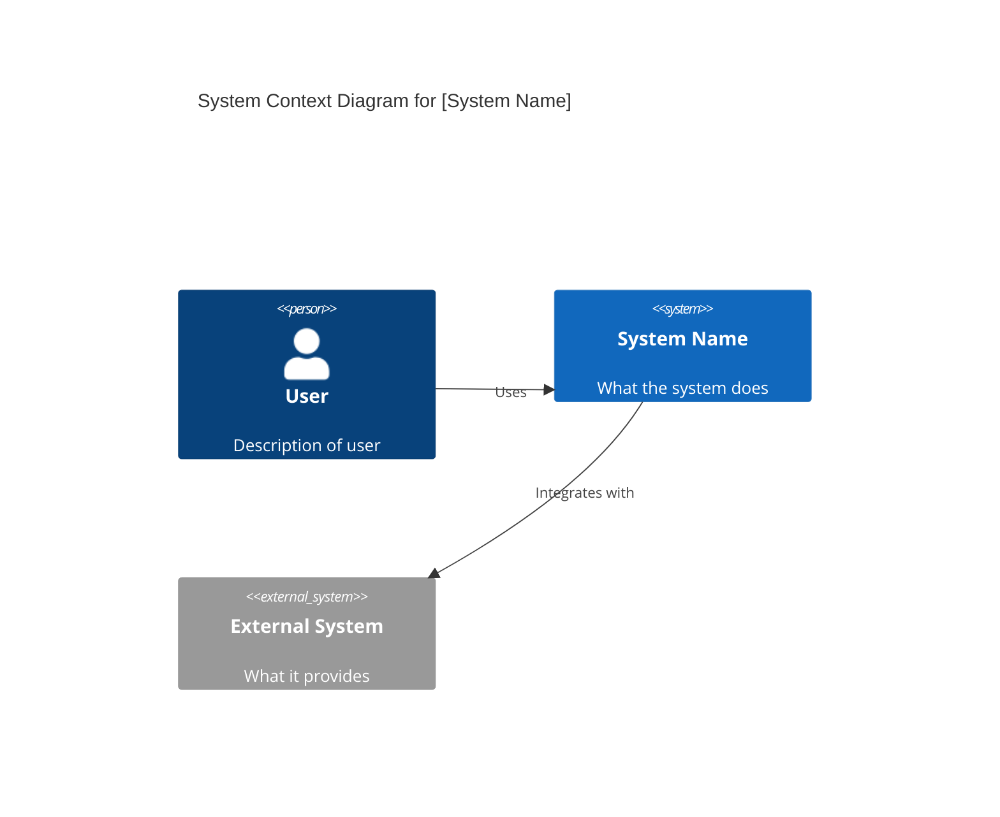

# Architecture Documentation Generator

Generate complete architecture documentation with diagrams using established frameworks and best practices.

## Workflow

For DAP create/update work, read `references/dap-arc42-mapping.md` and the packaged
`framework/contribution-contract.md`. Default to twelve arc42 sections with
REQ/CON/DES/ADR/VER links, source revisions and evidence locators. Keep the user's
chosen format for standalone documentation. Link an authorized immutable
evaluation summary in a generated appendix; never present a planned test as
delivery proof or rewrite accepted ADR reasoning. Resolve packaged specialists
through the outer package's catalogue when available.

```
1. Determine Scope → What system/feature to document?
2. Select Framework → C4, arc42, TOGAF, or ISO 42010?
3. Gather Information → Codebase analysis, interviews, or verbal description
4. Generate Views → Architecture views with diagrams
5. Document Decisions → ADRs for key choices
6. Review & Refine → Ensure completeness and consistency
```

## Step 1: Determine Scope

Ask or infer:
- **System boundary**: What is being documented? (monolith, service, feature, platform)
- **Audience**: Developers, architects, operations, leadership?
- **Purpose**: New system design, existing system documentation, compliance, onboarding?
- **Depth**: High-level overview or detailed specification?

## Step 2: Select Framework

| Framework | Best For | Output Structure |
|-----------|----------|------------------|
| **C4 Model** | System/container/component visualization | 4 levels: Context → Container → Component → Code |
| **arc42** | Complete architecture documentation | 12 sections covering all aspects |
| **TOGAF** | Enterprise architecture, compliance | ADM phases with artifacts |
| **ISO 42010** | Standards-compliant documentation | Views and viewpoints |

### Framework Selection Guide

- **C4 Model**: Use when primary goal is visual communication of system structure. Best for technical audiences.
- **arc42**: Use for comprehensive documentation of a system. Includes requirements, constraints, risks, and cross-cutting concerns.
- **TOGAF**: Use for enterprise-level architecture or when organizational compliance is required.
- **ISO 42010**: Use when formal architecture description standards are needed.

Read the appropriate reference file for detailed guidance:
- `references/c4-model.md` - C4 Model with official review checklist
- `references/arc42-template.md` - arc42 template with all 12 sections
- `references/togaf-adm.md` - TOGAF Architecture Development Method
- `references/iso42010.md` - ISO 42010 views and viewpoints
- `references/adr-template.md` - MADR ADR templates and best practices

## Step 3: Gather Information

Methods (choose based on context):

1. **Codebase Analysis**: Scan repository structure, identify components, trace dependencies
2. **Verbal Description**: User describes the system; extract architecture from conversation
3. **Existing Docs**: Read README, ADRs, API specs, or previous architecture docs
4. **Interview Style**: Ask targeted questions about the system

Key information to extract:
- System boundaries and external dependencies
- Major components/services and their responsibilities
- Data flow and communication patterns
- Technology choices and constraints
- Quality attributes (performance, security, scalability)

Label information as confirmed, inferred or unresolved and record its source and
freshness. A diagram is a view of a baseline, not proof that the deployed system
still matches it; include owners and a review trigger for documentation that can
drift.

## Step 4: Generate Views with Diagrams

### Diagram Format Selection

| Diagram Type | Recommended Format | Rationale |
|--------------|-------------------|-----------|
| C4 Context | **Mermaid** | Widely supported in markdown/docs |
| C4 Container | **Mermaid** | C4 extension available |
| C4 Component | **Mermaid** | Best for technical docs |
| Sequence | **Mermaid** | Clean, readable |
| Deployment | **Mermaid** | Good infrastructure support |
| Complex Layouts | **Draw.io** | When visual editing needed |

### Generating Diagrams

Use `assets/mermaid-templates/` for Markdown diagrams,
`assets/plantuml-templates/` when the consumer supports PlantUML, and
`assets/drawio-templates/` for editable drawings. Select only the needed template
and replace placeholders with actual system elements.

**Mermaid C4 Example:**


## Step 5: Document Decisions (ADRs)

For each significant architectural decision, create an ADR. Use the MADR template (Markdown Architectural Decision Records) recommended by Thoughtworks Technology Radar.

**ADR Best Practices:**
- Store in source control (not wiki)
- Each ADR covers ONE decision
- Use present tense imperative verb phrases for naming
- Include rationale, context, and consequences
- Accepted or rejected ADRs preserve their decision history. Editorial corrections are annotated; substantive changes use a new reviewed ADR that supersedes the prior record.

**Simple MADR Template:**
```markdown
# {short title of solved problem and solution}

## Status
{Proposed | Accepted | Deprecated | Superseded by [ADR-{number}]}

## Context
{Describe the context and problem statement.}

## Decision
{Describe the decision that was made.}

## Consequences
{Describe the resulting context.}

### Positive
- {benefit 1}

### Negative
- {tradeoff 1}
```

**Elaborate MADR Template (with options comparison):**
```markdown
# {short title}

## Status
{Proposed | Accepted | Deprecated}

## Context
{Problem statement and context.}

## Decision Drivers
{Factors that influenced the decision.}

## Considered Options
{List of options evaluated.}

## Decision Outcome
{Chosen option and justification.}

## Pros and Cons of Options

### {Option 1}
- Good: {advantage}
- Bad: {disadvantage}
```

**File naming:** `{number}-{verb-phrase}.md` (e.g., `001-choose-database.md`)

Read `references/adr-template.md` for complete templates and team practices. For structured trade-off analysis behind a decision (weighted scoring, sensitivity checks), use **arch-decision**.

## Step 6: Review & Refine

Checklist:
- [ ] All major components documented
- [ ] Diagrams are consistent with text descriptions
- [ ] ADRs cover key decisions
- [ ] Quality attributes addressed
- [ ] External dependencies identified
- [ ] Constraints and assumptions documented
- [ ] Source locators, freshness and unresolved questions recorded
- [ ] Views are consistent with the same named baseline and audience

## Output Formats

Generate documentation as:
- **Markdown** (default): For version control and developer tools
- **HTML**: For sharing with non-technical stakeholders
- **PDF**: For formal documentation or compliance

## Tech Stack Considerations

While framework-agnostic, adjust recommendations based on detected stack:

| Stack | Common Patterns | Diagram Focus |
|-------|-----------------|---------------|
| Web/Microservices | API Gateway, Service Mesh, Event-driven | Container + Sequence |
| Cloud-Native | Serverless, Containers, Managed Services | Deployment + Container |
| Enterprise Java/.NET | Layered, DDD, CQRS | Component + Sequence |
| Monolith | Modular, Clean Architecture | Component + Package |

## Examples

- Create a C4 context diagram for a customer onboarding platform.
- Generate an ADR for choosing PostgreSQL over MySQL.
- Produce an arc42 overview for a microservices platform with multiple teams.

## Common Gotchas

- Keep each view focused; do not cram context, container, and component detail into one diagram.
- Use references for long explanations and examples instead of expanding `SKILL.md` indefinitely.
- Match the framework to the audience; do not force TOGAF or ISO 42010 when a simpler C4 set is enough.

## Further Reading

- `references/awesome-architecture.md` — Curated external articles, videos, libraries, and samples per topic (awesome-architecture.com)
- `references/documentation-automation.md` — Documentation Automation Reference
- `references/skill-testing.md` — Skill Testing Reference

## Cross-skill handoff

Consume one named architecture baseline, decision history and specialist evidence.
Cross-check component names, IDs, protocols, trust boundaries and deployment nodes
across static and runtime views. Give arch-review unresolved inconsistencies; link its
design findings separately from arch-evaluate process results. C4 views can populate
arc42 sections; these approaches are complementary, not mutually exclusive.

## Related Skills

- **arch-review** - Validate and assess existing architecture documentation
- **arch-decision** - Record decisions (ADRs) referenced from the documentation
- **arch-governance** - Maintain documentation as part of architecture governance
- **arch-fitness** - Encode documented decisions as automated checks
- **arch-orchestrator** - Orchestrate end-to-end design including documentation deliverables
