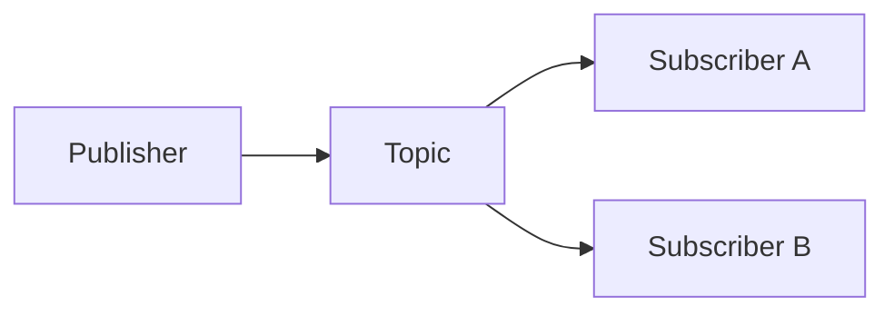
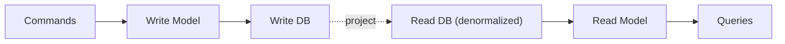
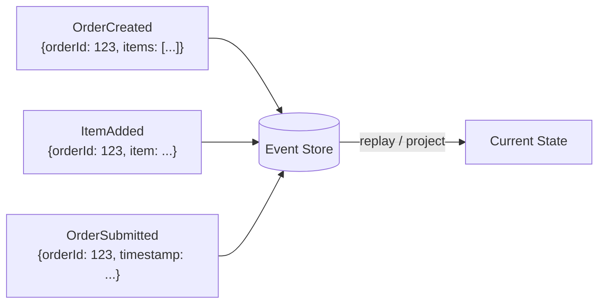
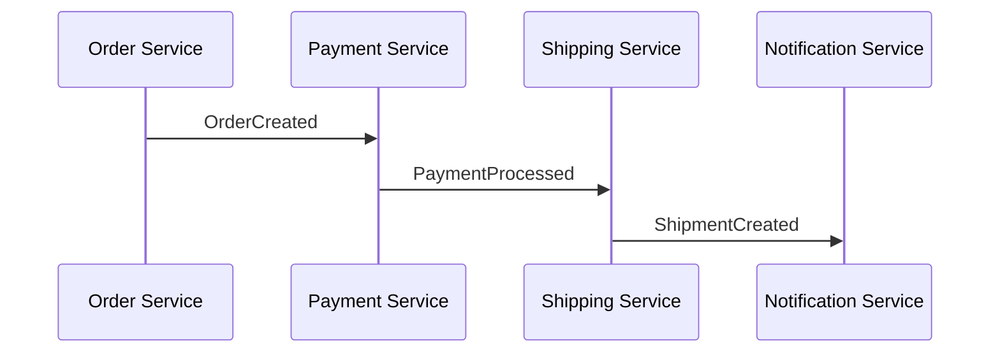
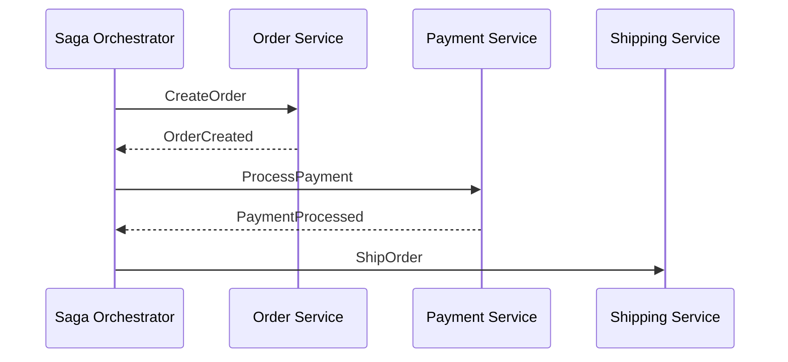

# Event-Driven Architecture

Systematic approach to designing event-driven systems.

## DAP contribution

For a DAP invocation, read `framework/contribution-contract.md` from the outer
package root (the repository root in a source checkout). Keep standalone tasks
within their requested scope. Use `assets/design-template.md` and record event versus command intent, schema version, producer/consumer ownership, delivery/ordering scope, replay/idempotency and compensation verification.
Return evidence-linked proposals and VER plans, not invented approvals or delivery proof.

## Workflow

```
1. Identify Events → What happens in the domain?
2. Choose Pattern → Pub/sub, streaming, CQRS?
3. Design Contracts → Event schemas and versions
4. Implement Flows → Producers, consumers, handlers
5. Handle Failures → Retries, dead letter queues
6. Monitor → Event flow visibility
```

## Step 1: Event Types

| Type | Description | Example |
|------|-------------|---------|
| **Domain Event** | Business-meaningful occurrence | OrderPlaced |
| **Integration Event** | Cross-boundary notification | PaymentProcessed |
| **Command** | Request to perform action | PlaceOrder |
| **Query** | Request for data | GetOrderStatus |

## Step 2: Messaging Patterns

### Pub/Sub



**Use when:** Multiple consumers, loose coupling.

### Point-to-Point

```
Producer → Queue → Consumer
```

**Use when:** One competing consumer handles each delivery; durability, acknowledgments, retries and idempotency determine processing guarantees.

### Request/Reply

```
Client → Request Queue → Service → Reply Queue → Client
```

**Use when:** Async request/response needed.

## Step 3: CQRS

**Command Query Responsibility Segregation** — Separate read and write models.



**When to Use:**
- Read/write patterns differ significantly
- Different scaling needs for reads vs writes
- Complex queries on write-optimized data

**Trade-offs:**
- Eventual consistency
- Increased complexity
- More infrastructure

These trade-offs apply when models/stores are separated. CQRS can use one
database and does not require event sourcing, a broker or eventual consistency.

## Step 4: Event Sourcing

Store state changes as events, not current state.



**Benefits:**
- Complete audit trail
- Temporal queries
- Debugging history
- Event replay

**Challenges:**
- Event schema evolution
- Snapshot management
- Query complexity

## Step 5: Saga Patterns

### Choreography

Each service publishes events and listens for others.



**Pros:** Simple, loose coupling.
**Cons:** Hard to track flow, debugging.

### Orchestration

Central coordinator manages the flow.



**Pros:** Clear flow, easier debugging.
**Cons:** Coordinator availability and durable state need explicit design; process coupling must be managed.

### Compensation

Business compensation on failure. Compensation is a new action that can fail or require manual recovery; it is not an atomic rollback.

| Step | Action | Compensation |
|------|--------|--------------|
| 1 | Create order | Cancel order |
| 2 | Process payment | Refund payment |
| 3 | Ship order | Return shipment |

## Step 6: Event Schema Design

```json
{
  "eventId": "uuid",
  "eventType": "OrderPlaced",
  "version": "1.0",
  "timestamp": "2024-01-15T10:30:00Z",
  "source": "order-service",
  "data": {
    "orderId": "123",
    "customerId": "456",
    "items": [{"productId": "example-product", "quantity": 1}]
  }
}
```

### Schema Evolution Strategies

- **Additive changes** — Add new fields
- **Versioning** — Multiple schema versions
- **Upcasters** — Transform old events

## Step 7: Reliability

### Dead Letter Queues

Messages that fail repeatedly go to DLQ for investigation.

### Idempotency

Process same event multiple times without side effects.

```
Transaction: claim unique event ID + apply business change → commit → acknowledge
```

### Exactly-Once Semantics

A separate check-then-write races under concurrent delivery. Atomically couple
deduplication and the business update; external effects need their own idempotency
key or reconciliation protocol. Define deduplication scope and retention.

Design for at-least-once delivery by default. A transactional outbox, producer
idempotence and consumer deduplication reduce loss and duplication; they do not
make a multi-system workflow exactly once unless the broker, storage and
transaction boundaries prove that guarantee.

Make ordering scope, replay behavior, retention, back-pressure, consumer lag,
poison-message handling and schema compatibility explicit for every stream.

## Examples

- Design an order fulfillment saga with compensation across payment and shipping services.
- Introduce a transactional outbox to fix lost events between DB writes and publishes.
- Plan event schema evolution for a topic with a dozen consumers.

## Common Gotchas

- Consumers must be idempotent; at-least-once delivery is the realistic default everywhere.
- Event sourcing is a heavy commitment; do not adopt it just for an audit log.
- Uncoordinated database writes and event publication can diverge on crashes;
  use an outbox, transactional CDC or another proven atomicity boundary.
- A dead-letter queue without replay ownership, retention and redaction becomes a silent data cemetery.

## Further Reading

- `references/awesome-architecture.md` — Curated external articles, videos, libraries, and samples per topic (awesome-architecture.com)
- `references/cqrs-es.md` — CQRS & Event Sourcing Reference
- `references/event-deep-dive.md` — Event-Driven Architecture Deep Dive
- `references/messaging-patterns.md` — Messaging Patterns Reference

## Cross-skill handoff

Consume domain facts, integration consumers and transaction boundaries from arch-ddd,
arch-integration and arch-data. Return event/command schemas, ordering keys, delivery
scope, deduplication retention and replay ownership. Give arch-test duplicate, out-of-
order, crash-between-write-and-ack, poison-message and replay scenarios; give arch-observability lag/age and DLQ signals.

## Related Skills

- **arch-ddd** - Domain events and Event Storming
- **arch-microservices** - Service boundaries that events cross
- **arch-resilience** - DLQs, retries, and failure isolation
