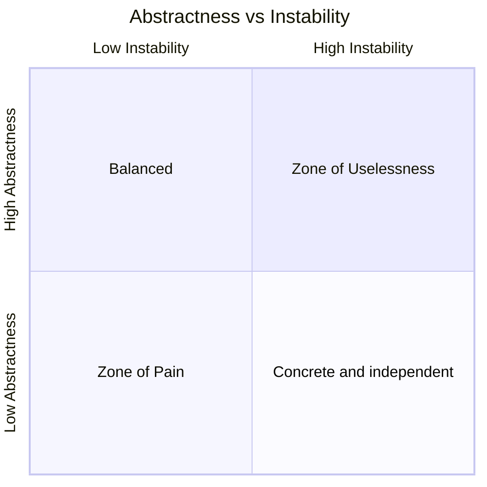
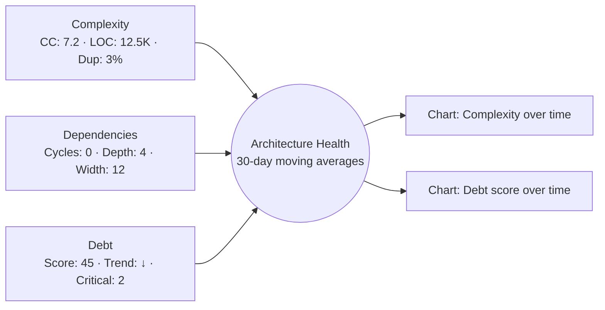

# Architecture Metrics

Systematic approach to measuring and tracking architecture health.

## DAP contribution

For a DAP invocation, read `framework/contribution-contract.md` from the outer
package root (the repository root in a source checkout). Keep standalone tasks
within their requested scope. Use `assets/dashboard-template.md` and record measurement definition and units, source revision, sampling window, baseline, uncertainty and explicitly adopted thresholds.
Return evidence-linked proposals and VER plans, not invented approvals or delivery proof.

## Workflow

```
1. Define Metrics → What to measure?
2. Collect Data → How to gather?
3. Analyze → What does it mean?
4. Visualize → Dashboard and reports
5. Act → Prioritize improvements
6. Track → Monitor over time
```

## Step 1: Complexity Metrics

### Code Metrics

| Metric | Description | Target |
|--------|-------------|--------|
| **Cyclomatic Complexity** | Decision points per function | < 10 |
| **Lines of Code** | Function/class size | < 50 lines/function |
| **Nesting Depth** | Maximum nesting level | < 4 |
| **Coupling** | Dependencies between modules | Low |
| **Cohesion** | Internal module unity | High |

The values in this table are starting signals, not universal quality gates. Set a
baseline for the language and system, then use trend, outliers and coupling
hotspots to choose interventions.

### Architecture-Level Metrics

| Metric | Formula | Interpretation |
|--------|---------|----------------|
| **Afferent Coupling (Ca)** | Incoming dependencies | How depended upon |
| **Efferent Coupling (Ce)** | Outgoing dependencies | What depends on |
| **Instability** | Ce / (Ca + Ce) | 0=stable, 1=unstable |
| **Abstractness** | Abstract classes / Total | 0=concrete, 1=abstract |

### Stability Formula

```
Instability = Ce / (Ca + Ce)

- 0.0 = Highly stable (no outgoing deps)
- 1.0 = Highly unstable (no incoming deps)
```

**Zone of Pain:** Low instability, low abstractness (stable and concrete).
**Zone of Uselessness:** High instability, high abstractness (abstract with few dependents).

When Ca + Ce is zero, report instability as undefined rather than dividing by zero.
Interpret the metrics in context, not as universal optimization targets. See
[metric definitions](https://www.ndepend.com/docs/code-metrics).



## Step 2: Dependency Analysis

### Dependency Graph Metrics

| Metric | Description | Concern |
|--------|-------------|---------|
| **Depth** | Longest dependency chain | Complexity |
| **Width** | Number of direct dependencies | Coupling |
| **Cycles** | Circular dependencies | Architecture violation |
| **Fan-in/Fan-out** | Incoming/outgoing dependency counts | Change propagation |

### Dependency Rules

- **Acyclic Dependencies Principle** — No cycles
- **Stable Dependencies Principle** — Depend on stable modules
- **Stable Abstractions Principle** — Stable modules should be abstract

## Step 3: Technical Debt Metrics

### Debt Quantification

| Category | Metric | Measurement |
|----------|--------|-------------|
| **Code Debt** | Code smells | SonarQube |
| **Test Debt** | Unverified critical behavior | Requirement and failure-mode coverage |
| **Doc Debt** | Missing docs | Coverage % |
| **Dependency Debt** | Outdated packages | Age, CVEs |
| **Architecture Debt** | Violations | Dependency cycles |

### Debt Score

```
Debt Score = (Critical × 10) + (High × 5) + (Medium × 2) + (Low × 1)
```

### Debt Trend

| Trend | Meaning | Action |
|-------|---------|--------|
| ↑ Increasing | Getting worse | Address urgently |
| → Stable | Plateau | Plan improvements |
| ↓ Decreasing | Improving | Continue effort |

## Step 4: Design Health Metrics

### SOLID Compliance

| Principle | Metric | How to Measure |
|-----------|--------|----------------|
| **SRP** | Class responsibility count | Manual review |
| **OCP** | Open for extension points | Pattern analysis |
| **LSP** | Subtype substitutability | Test coverage |
| **ISP** | Interface size | Method count |
| **DIP** | Dependency direction | Dependency graph |

### Pattern Compliance

| Pattern | Violation | Detection |
|---------|-----------|-----------|
| **Layered** | Skip-level calls | Dependency analysis |
| **Hexagonal** | Core depends on infrastructure | Import analysis |
| **Microservices** | Shared databases | Schema analysis |

## Step 5: Dashboard Metrics

### Architecture Health Dashboard



### Key Indicators

| Indicator | Green | Yellow | Red |
|-----------|-------|--------|-----|
| Cyclomatic Complexity | < 10 | 10-20 | > 20 |
| Test Coverage | > 80% | 60-80% | < 60% |
| Debt Score | < 50 | 50-100 | > 100 |
| Dependency Cycles | 0 | 1-2 | > 2 |

Use green/yellow/red bands only after recording the measurement definition,
sampling window and decision owner. Avoid collapsing unlike metrics into a single
health score unless the weighting and loss of information are explicit.

## Step 6: Tools

| Tool | Purpose | Language |
|------|---------|----------|
| **SonarQube** | Code quality | Multi |
| **Structure101** | Architecture analysis | Multi |
| **jDepend** | Java dependency analysis | Java |
| **Dependency-Cruiser** | JS/TS dependency analysis | JS/TS |
| **Pydeps** | Python dependency analysis | Python |

## Examples

- Baseline complexity and coupling metrics before a large refactor.
- Find modules in the zone of pain using instability and abstractness.
- Set up a debt score trend dashboard for quarterly architecture reviews.

## Common Gotchas

- Metrics gamed as targets stop measuring health (Goodhart's law); use them as signals, not KPIs.
- Absolute thresholds vary by language and domain; trends matter more than snapshots.
- High coverage with weak assertions is still test debt; pair coverage with mutation score.

## Further Reading

- `references/awesome-architecture.md` — Curated external articles, videos, libraries, and samples per topic (awesome-architecture.com)
- `references/complexity-metrics.md` — Complexity Metrics Reference
- `references/metrics-deep-dive.md` — Metrics Deep Dive

## Cross-skill handoff

Consume the actual module boundaries and change history. Return metric definition,
population, units, time window, baseline and missing-data status to arch-review; use
arch-fitness only for explicitly adopted limits. Fan-in and fan-out are separate
dependency counts, not an import/export ratio; code coverage and class counts are
proxies, not direct proofs of design quality.

## Related Skills

- **arch-fitness** - Turning metric thresholds into CI gates
- **arch-refactoring** - Acting on what the metrics reveal
- **arch-review** - Metrics as evidence in reviews

## Output template

Use `assets/dashboard-template.md`. Populate its scope and evidence fields for DAP work;
keep missing measurements and approvals explicit.
