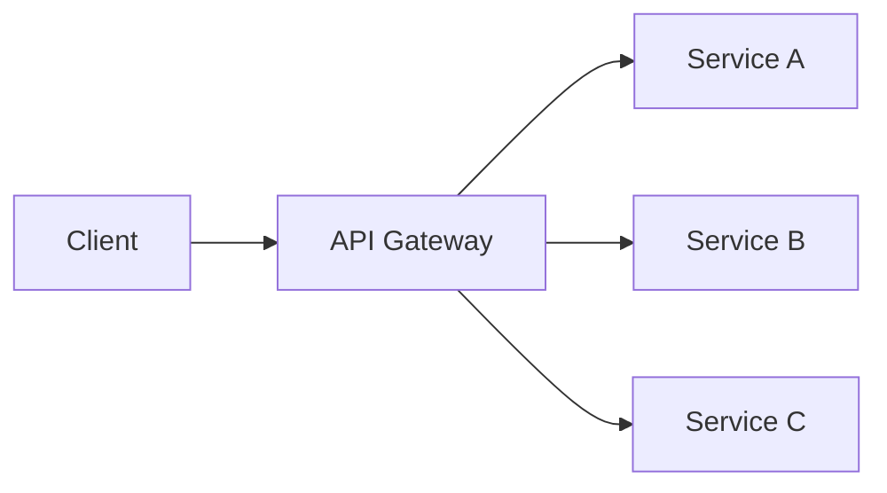
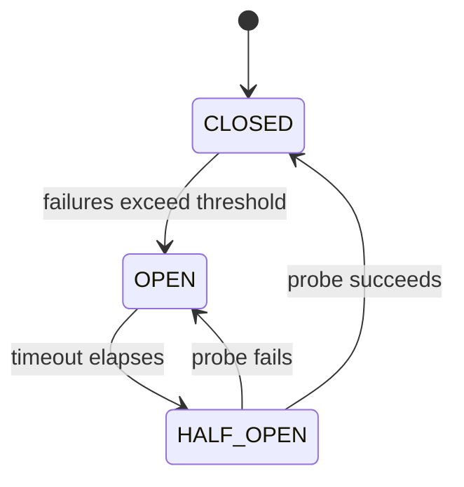

# Microservices Architecture

Systematic approach to designing microservices systems.

## DAP contribution

For a DAP invocation, read `framework/contribution-contract.md` from the outer
package root (the repository root in a source checkout). Keep standalone tasks
within their requested scope. Use `assets/review-template.md` and record service DES IDs, domain/data ownership, independent lifecycle evidence, consistency/failure scenarios and modular-monolith alternative.
Return evidence-linked proposals and VER plans, not invented approvals or delivery proof.

For DAP work, populate its scope and evidence fields; keep missing measurements and approvals explicit.

## Workflow

```
1. Define Bounded Contexts → Where to draw boundaries?
2. Design Services → What each service does?
3. Choose Communication → Sync vs async?
4. Implement Patterns → API gateway, service discovery
5. Ensure Resilience → Circuit breakers, retries
6. Monitor → Distributed tracing, logging
```

## Step 1: Service Decomposition

### Decomposition Strategies

| Strategy | Description | Use Case |
|----------|-------------|----------|
| **By Business Capability** | Align with business functions | Standard approach |
| **By Subdomain** | DDD bounded contexts | Complex domains |
| **By Data Ownership** | Separate data per service | Data-intensive |
| **By Team** | Conway's Law alignment | Large organizations |

### Service Size Guidelines

| Guideline | Recommendation |
|-----------|----------------|
| **Team Size** | 2-pizza team (5-8 people) |
| **Code Size** | Small enough to understand quickly |
| **Deployment** | Independent deployment |
| **Database** | Database per service |

These are heuristics, not entry criteria. Before creating a service, name its
bounded context, owning team, independent change reason, operational budget,
failure boundary and data ownership. Account for the platform, deployment and
observability tax of every additional service.

### Anti-Patterns

| Anti-Pattern | Problem | Solution |
|--------------|---------|----------|
| **Distributed Monolith** | Services coupled | Loosen coupling |
| **Nano Services** | Too many tiny services | Merge related services |
| **Data Duplication** | Same data in multiple services | Accept eventual consistency |
| **Shared Database** | Multiple services share DB | Separate databases |

## Step 2: Service Communication

### Synchronous Communication

| Pattern | Use Case | Trade-offs |
|---------|----------|------------|
| **REST** | Simple CRUD | Easy, but synchronous |
| **gRPC** | High performance | Fast, but complex |
| **GraphQL** | Flexible queries | Flexible, but complex |

### Asynchronous Communication

| Pattern | Use Case | Trade-offs |
|---------|----------|------------|
| **Message Queue** | Task distribution | Reliable, but eventual |
| **Event Streaming** | Event sourcing | Ordered, but complex |
| **Pub/Sub** | Broadcasting | Delivery guarantees depend on broker, subscription and acknowledgment policy |

### Communication Selection

```
Need real-time response? → Synchronous (REST/gRPC)
Need durable decoupling? → Evaluate queue/stream persistence and acknowledgment policy
Need decoupling? → Pub/Sub
Need ordering? → Specify ordering key, partition scope and consumer concurrency
```

## Step 3: Service Patterns

### API Gateway



**Responsibilities:**
- Request routing
- Authentication
- Rate limiting
- Load balancing

### Service Discovery

| Type | Description | Tools |
|------|-------------|-------|
| **Client-Side** | Client queries registry | Eureka, Consul |
| **Server-Side** | Load balancer queries | AWS ELB |
| **DNS-Based** | DNS resolution | CoreDNS |

### Circuit Breaker



## Step 4: Data Management

### Database per Service

| Pattern | Description | Trade-off |
|---------|-------------|-----------|
| **Database per Service** | Each service owns its data | Strong isolation, eventual consistency |
| **Shared Database** | Multiple services share DB | Simple, tight coupling |
| **CQRS** | Separate read/write models | Performance, complexity |

### Data Consistency

| Pattern | Description | Use Case |
|---------|-------------|----------|
| **Saga** | Distributed transaction | Multi-service writes |
| **Event Sourcing** | Store events, not state | Audit trail |
| **CQRS** | Separate reads from writes | Different read/write patterns |

## Step 5: Deployment Patterns

| Pattern | Description |
|---------|-------------|
| **Containerization** | Docker, Kubernetes |
| **Service Mesh** | Istio, Linkerd |
| **GitOps** | ArgoCD, Flux |
| **Blue-Green** | Zero-downtime deploys |

## Step 6: Monitoring & Observability

| Concern | Solution |
|---------|----------|
| **Distributed Tracing** | Jaeger, Zipkin, X-Ray |
| **Centralized Logging** | ELK, Loki |
| **Metrics** | Prometheus, Datadog |
| **Service Health** | Health checks, readiness probes |

## Examples

- Decompose an e-commerce monolith along bounded contexts using the strangler fig.
- Fix a distributed monolith where every deploy requires four services to release together.
- Choose sync vs async communication per interaction in a new platform.

## Common Gotchas

- Services that must deploy together are a distributed monolith - the worst of both worlds.
- Start with a modular monolith unless team scale demands independent deployment.
- Synchronous call chains across services multiply latency and failure probability.
- A team or database boundary alone is not a service boundary; verify independent lifecycle and clear ownership.

Read `references/microservices-deep-dive.md` for boundary and operational trade-offs.

## Further Reading

- `references/awesome-architecture.md` — Curated external articles, videos, libraries, and samples per topic (awesome-architecture.com)
- `references/microservices-patterns.md` — Microservices Patterns Reference

## Cross-skill handoff

Consume bounded contexts, invariants and ownership from arch-ddd and arch-data. Return a
topology with per-interaction consistency/failure contracts to arch-api, arch-event and
arch-resilience. Verify independent deployment with mixed-version tests and changes that
remain local. Compare the same requirements against a modular monolith before accepting
network, platform and on-call cost.

## Related Skills

- **arch-ddd** - Finding service boundaries
- **arch-resilience** - Circuit breakers, retries, bulkheads
- **arch-event** - Sagas and async communication
- **arch-integration** - Gateways and service mesh
