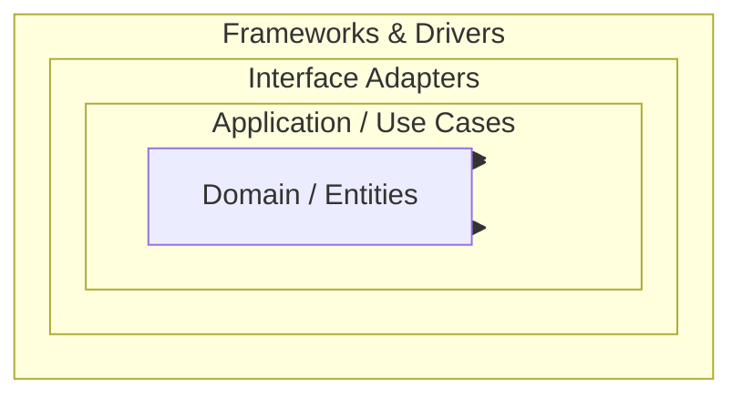
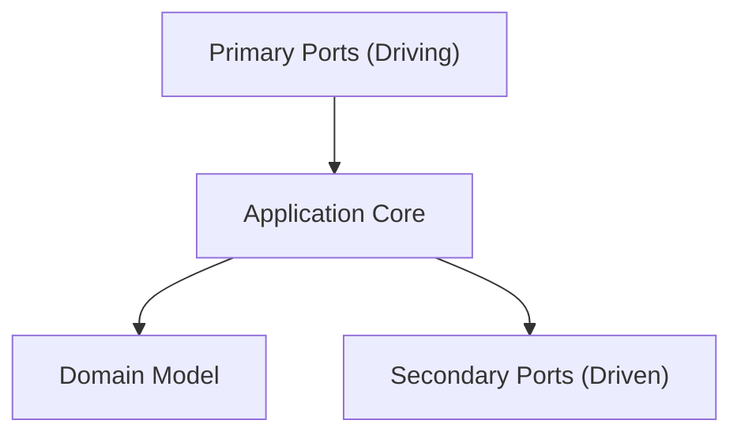
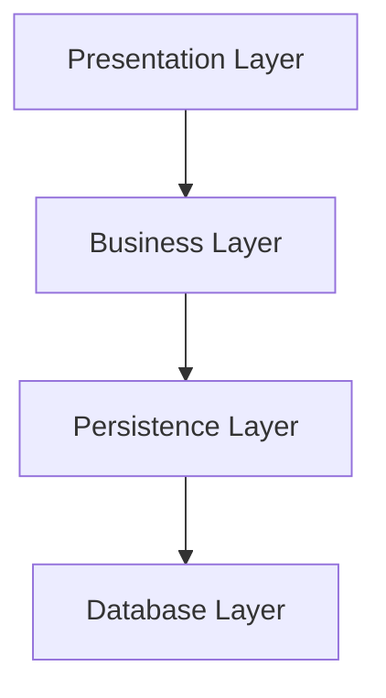
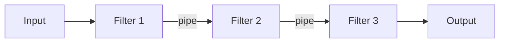

# Architecture Patterns

Systematic approach to selecting and applying architecture patterns.

## Workflow

```
1. Understand Requirements → What qualities matter?
2. Evaluate Patterns → Which patterns fit?
3. Select Pattern → Choose based on trade-offs
4. Apply Pattern → Implement with best practices
5. Validate → Ensure pattern is followed
6. Document → Record pattern usage
```

## Step 1: Pattern Categories

### Structural Patterns

| Pattern | Description | Use Case |
|---------|-------------|----------|
| **Layered** | Horizontal layers (UI, Business, Data) | Traditional apps |
| **Hexagonal** | Ports and adapters | Testable systems |
| **Clean Architecture** | Concentric circles with dependencies inward | Complex business logic |
| **Onion Architecture** | Similar to Clean, emphasizes domain | Domain-centric systems |
| **Vertical Slice** | Organize by feature; each slice owns all layers | Feature-focused teams, CQRS |
| **Modular Monolith** | Single deployable, isolated modules with enforced boundaries | Monolith simplicity with module autonomy |

### Behavioral Patterns

| Pattern | Description | Use Case |
|---------|-------------|----------|
| **Event-Driven** | Events trigger processing | Async systems |
| **CQRS** | Separate read/write models | Different read/write patterns |
| **Saga** | Distributed transactions | Multi-service operations |
| **State Machine** | State transitions | Workflow systems |

### Integration Patterns

| Pattern | Description | Use Case |
|---------|-------------|----------|
| **API Gateway** | Single entry point | External APIs |
| **Service Mesh** | Infrastructure communication | Microservices |
| **Message Broker** | Async communication | Decoupled systems |
| **Event Streaming** | Ordered event log | Event sourcing |

## Step 2: Clean Architecture

### Concentric Circles



### Dependency Rule

Dependencies point inward only:
- **Domain** → Nothing (innermost)
- **Application** → Domain
- **Interface Adapters** → Application, Domain
- **Frameworks** → All (outermost)

### Key Principles

| Principle | Description |
|-----------|-------------|
| **Independence** | Frameworks are plugins |
| **Testability** | Business logic testable without UI/DB |
| **UI Independence** | UI can change without affecting business |
| **Database Independence** | Business logic unaware of storage |

## Step 3: Hexagonal Architecture

### Ports and Adapters



### Port Types

| Port Type | Description | Examples |
|-----------|-------------|----------|
| **Primary** | Drives the application | REST API, CLI, UI |
| **Secondary** | Driven by the application | Database, Email, File |

### Adapter Types

| Adapter Type | Description | Examples |
|--------------|-------------|----------|
| **Driving** | Implements primary ports | REST controller, CLI handler |
| **Driven** | Implements secondary ports | Database adapter, Email adapter |

## Step 4: Layered Architecture

### Traditional Layers



### Layer Rules

| Rule | Description |
|------|-------------|
| **Dependency Direction** | Upper layers depend on lower |
| **No Skip Layers** | Don't bypass intermediate layers |
| **Interface Contracts** | Layers communicate via interfaces |
| **Single Responsibility** | Each layer has one purpose |

## Step 5: Pipes and Filters

### Pattern Structure



### Filter Types

| Type | Description | Use Case |
|------|-------------|----------|
| **Transform** | Convert data format | Data transformation |
| **Filter** | Selectively pass data | Data filtering |
| **Aggregate** | Combine multiple inputs | Data aggregation |
| **Route** | Direct to different paths | Content-based routing |

## Step 6: Pattern Selection Matrix

| Requirement | Recommended Pattern |
|-------------|---------------------|
| **Testability** | Hexagonal, Clean |
| **Complex Business Logic** | Clean Architecture |
| **Simple CRUD** | Layered |
| **Event Processing** | Event-Driven, CQRS |
| **Distributed Systems** | Service Mesh, Saga |
| **Legacy Integration** | Hexagonal, Adapter |
| **Independent Feature Delivery** | Vertical Slice |
| **Monolith Simplicity, Strong Boundaries** | Modular Monolith |

## Examples

- Choose between layered and hexagonal architecture for a new order service.
- Introduce ports and adapters to make a legacy core testable.
- Validate that a codebase actually follows its claimed clean architecture.

## Common Gotchas

- Patterns are trade-offs, not virtue; layers and indirection have a real cost in simple CRUD apps.
- A pattern only half-applied (domain importing frameworks) gives the cost without the benefit.
- Enforce the dependency rule with automated checks or it will erode (see arch-fitness).

## Further Reading

- `references/awesome-architecture.md` — Curated external articles, videos, libraries, and samples per topic (awesome-architecture.com)
- `references/architecture-patterns.md` — Architecture Patterns Reference

## Related Skills

- **arch-ddd** - Domain model at the center of these patterns
- **arch-fitness** - Enforcing pattern rules in CI
- **arch-refactoring** - Migrating toward a target pattern

## Pattern Review Template

```markdown
## Pattern Review: [System]

### Selected Pattern
- Pattern: [Name]
- Rationale: [Why this pattern]

### Implementation
| Component | Pattern Element | Status |
|-----------|----------------|--------|

### Compliance
| Rule | Status | Violations |
|------|--------|------------|

### Recommendations
1. [Improvement]
```
