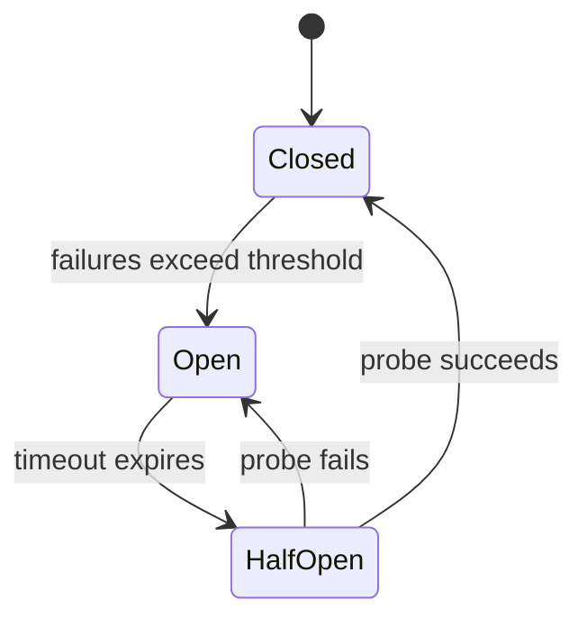
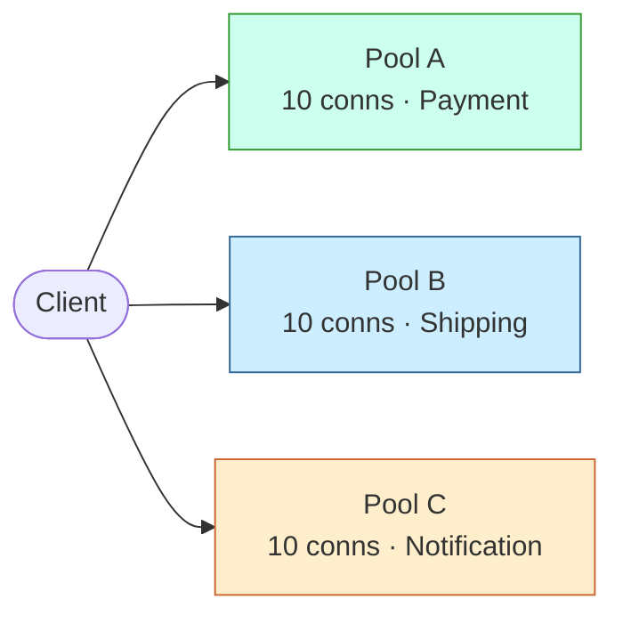

# Resilience Patterns

Systematic approach to building fault-tolerant distributed systems.

## Workflow

```
1. Identify Failures → What can fail?
2. Design Patterns → How to handle failures?
3. Configure Policies → Thresholds and timeouts
4. Implement Fallbacks → Graceful degradation
5. Test → Chaos engineering, fault injection
6. Monitor → Track failure rates and recovery
```

## Step 1: Failure Types

| Type | Example | Impact |
|------|---------|--------|
| **Transient** | Network blip, timeout | Temporary |
| **Persistent** | Service down, disk full | Extended |
| **Intermittent** | Flaky service, race condition | Unpredictable |
| **Cascading** | Upstream failure propagates | System-wide |

## Step 2: Resilience Patterns

### Circuit Breaker

Prevents cascading failures by stopping calls to failing services.



**States:**
- **Closed** — Normal operation, counting failures
- **Open** — Failing fast, no calls allowed
- **Half-Open** — Testing if service recovered

**Configuration:**
- Failure threshold: 5 failures in 60 seconds
- Open duration: 30 seconds
- Half-open max calls: 3

### Retry

Automatically retry failed operations.

**Strategies:**
| Strategy | Description | Use Case |
|----------|-------------|----------|
| **Fixed** | Same delay between retries | Transient failures |
| **Exponential** | Increasing delay | Load reduction |
| **Exponential + Jitter** | Randomized delay | Thundering herd prevention |

**Configuration:**
- Max retries: 3
- Initial delay: 100ms
- Max delay: 5s
- Backoff multiplier: 2

### Bulkhead

Isolate failures to prevent system-wide impact by partitioning resources into independent pools.



**Benefits:**
- Prevents one failing service from exhausting resources
- Limits concurrent calls per dependency
- Enables graceful degradation

### Timeout

Prevent indefinite waiting for responses.

| Type | Description | Use Case |
|------|-------------|----------|
| **Connection** | Time to establish connection | Network issues |
| **Read** | Time to receive response | Slow processing |
| **Total** | Total operation time | End-to-end limit |

### Fallback

Provide alternative when primary fails.

```
Primary Call → Failure → Fallback
                         ├── Cached response
                         ├── Default value
                         ├── Alternative service
                         └── Degraded functionality
```

## Step 3: Composition Patterns

### Retry + Circuit Breaker

```
Request → Retry → Circuit Breaker → Service
           ↑           ↓
           └── Fallback ←── (Open)
```

### Bulkhead + Timeout + Fallback

```
Request → Bulkhead → Timeout → Service
              ↓         ↓
              └── Fallback ←── (Full/Timeout)
```

## Step 4: Configuration Matrix

| Pattern | Failure Threshold | Recovery | Timeout |
|---------|-------------------|----------|---------|
| Circuit Breaker | 5 failures/60s | 30s open | 5s |
| Retry | 3 attempts | 100ms-5s | - |
| Bulkhead | 10 concurrent | Immediate | 5s |
| Timeout | - | - | 5s |

## Step 5: Chaos Engineering

### Experiment Types

| Type | Purpose | Example |
|------|---------|---------|
| **Network** | Test latency/packet loss | Add 200ms latency |
| **Resource** | Test CPU/memory pressure | Consume 80% CPU |
| **Service** | Test service failures | Kill service instance |
| **State** | Test data corruption | Corrupt cache |

### Game Day Checklist

- [ ] Define steady state hypothesis
- [ ] Inject realistic failures
- [ ] Observe system behavior
- [ ] Verify recovery
- [ ] Document findings

## Examples

- Add circuit breakers and fallbacks around a flaky third-party payment gateway.
- Design retry policies with exponential backoff and jitter for a message consumer.
- Run a game day that kills a service instance and verifies recovery.

## Common Gotchas

- Retries without idempotency create duplicate side effects (double charges, double emails).
- Retry storms amplify outages; combine retries with circuit breakers and jitter.
- Timeouts must shrink down the call chain; equal timeouts everywhere guarantee cascading failures.

## Further Reading

- `references/awesome-architecture.md` — Curated external articles, videos, libraries, and samples per topic (awesome-architecture.com)
- `references/resilience-deep-dive.md` — Resilience Engineering Deep Dive
- `references/resilience-patterns.md` — Resilience Patterns Reference

## Related Skills

- **arch-perf** - Latency budgets that timeouts must respect
- **arch-observability** - Detecting failures the patterns must handle
- **arch-event** - Dead letter queues and idempotent consumers

## Resilience Review Template

```markdown
## Resilience Review: [System]

### Dependencies
| Service | Criticality | Patterns Used |
|---------|-------------|---------------|

### Configuration
| Pattern | Setting | Value |
|---------|---------|-------|

### Failure Scenarios
| Scenario | Expected Behavior | Verified |
|----------|-------------------|----------|

### Recommendations
1. [Improvement]
```
